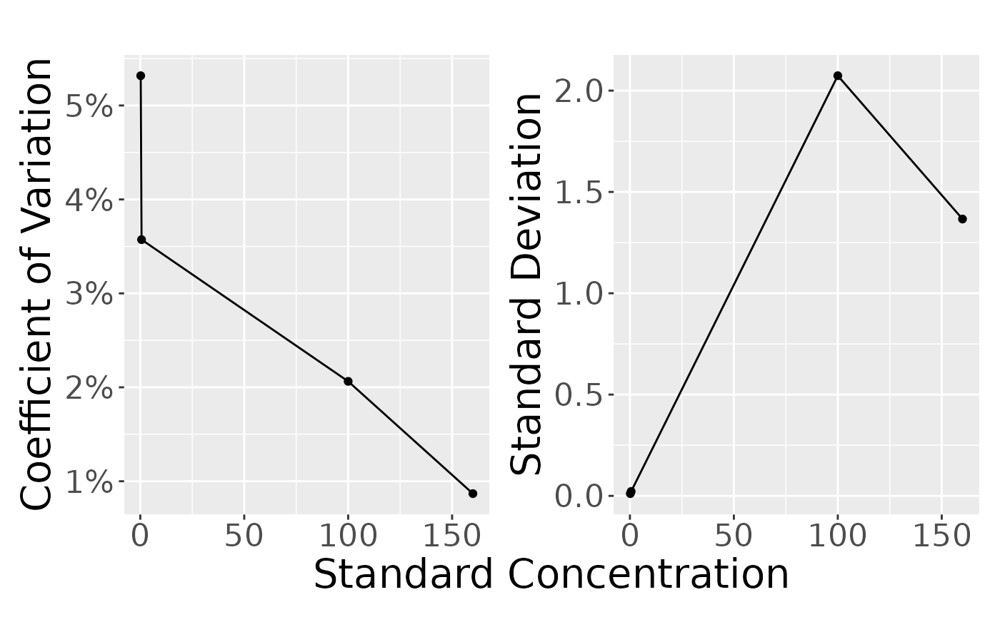

# Estimating Residual Variability and LLOQ

``` r
library(PKbioanalysis)
library(dplyr)
```

    ## 
    ## Attaching package: 'dplyr'

    ## The following objects are masked from 'package:stats':
    ## 
    ##     filter, lag

    ## The following objects are masked from 'package:base':
    ## 
    ##     intersect, setdiff, setequal, union

``` r
d <- read.csv(system.file("extdata", "GU_1.csv", package = "PKbioanalysis"))
```

``` r
head(d)
```

    ##   TYPE  conc stdconc
    ## 1 LLOQ 0.232     0.2
    ## 2 LLOQ 0.206     0.2
    ## 3 LLOQ 0.203     0.2
    ## 4 LLOQ 0.202     0.2
    ## 5 LLOQ 0.207     0.2
    ## 6 LLOQ 0.212     0.2

``` r
only_qc <- d |> filter(TYPE %in% c("LLOQ", "LQC", "MQC", "HQC"))

only_qc <- only_qc  |> 
    group_by(TYPE, stdconc) |>
    summarize(
        mean = mean(conc),
        sd = sd(conc),
        cv = sd(conc)/mean(conc)*100,
        n = n()
    )
```

    ## `summarise()` has regrouped the output.
    ## ℹ Summaries were computed grouped by TYPE and stdconc.
    ## ℹ Output is grouped by TYPE.
    ## ℹ Use `summarise(.groups = "drop_last")` to silence this message.
    ## ℹ Use `summarise(.by = c(TYPE, stdconc))` for per-operation grouping
    ##   (`?dplyr::dplyr_by`) instead.

``` r
only_qc
```

    ## # A tibble: 4 × 6
    ## # Groups:   TYPE [4]
    ##   TYPE  stdconc    mean     sd    cv     n
    ##   <chr>   <dbl>   <dbl>  <dbl> <dbl> <int>
    ## 1 HQC     160   157.    1.37   0.868     6
    ## 2 LLOQ      0.2   0.210 0.0112 5.32      6
    ## 3 LQC       0.6   0.613 0.0219 3.57      6
    ## 4 MQC     100   100.    2.07   2.06      6

``` r
plot_var_pattern(only_qc)
```



``` r
fit <- fit_var(d)


formated_print(fit)
```

| Error Type   | Estimate | Lower CI | Upper CI | Method | Gradient | SE    | RSE%  |
|--------------|----------|----------|----------|--------|----------|-------|-------|
| Constant     | 0.016    | 0.008    | 0.033    | nlminb | 0.000    | 0.006 | 37.6% |
| Proportional | 3.28%    | 2.45%    | 4.39%    | nlminb | 0.000    | 0.005 | 15.0% |

## Estimate LLOQ

``` r
estim_lloq(add_err = 0.016, prop_err = 0.032, cv_lloq = 0.1 , cv_lqc = 0.05)
```

    ## $lloq
    ## [1] 0.1688801
    ## 
    ## $lqc
    ## [1] 0.5066402
    ## 
    ## $lqc_x2
    ## [1] 1.01328
    ## 
    ## $rsd_lloq
    ## [1] 0.1
    ## 
    ## $rsd_lqc
    ## [1] 0.04495925
    ## 
    ## $rsd_lqc_x2
    ## [1] 0.0356838
    ## 
    ## $add_err
    ## [1] 0.016
    ## 
    ## $prop_err
    ## [1] 0.032
    ## 
    ## $lloq_rsd_contr
    ## [1] 0.1
    ## 
    ## $lqc_rsd_contr
    ## [1] 0.05

## Estimated dilution limit

Divide additive/proportional error

``` r
estim_dil_limit(add_err = 0.016, prop_err = 0.032, lloq = 0.2)
```

    ## [1] 0.5
