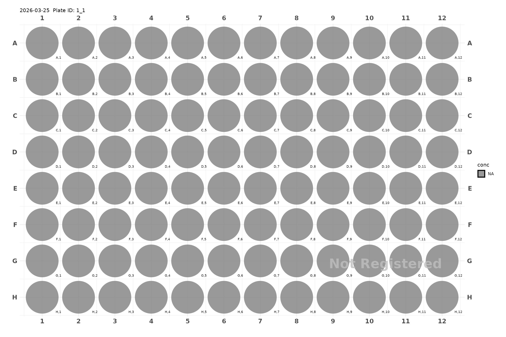
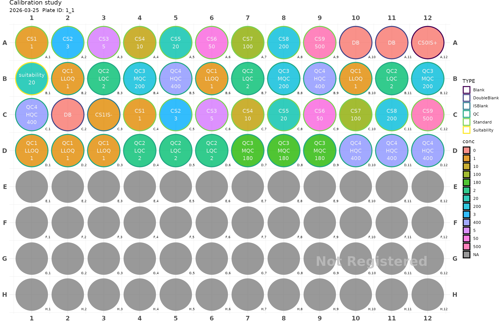
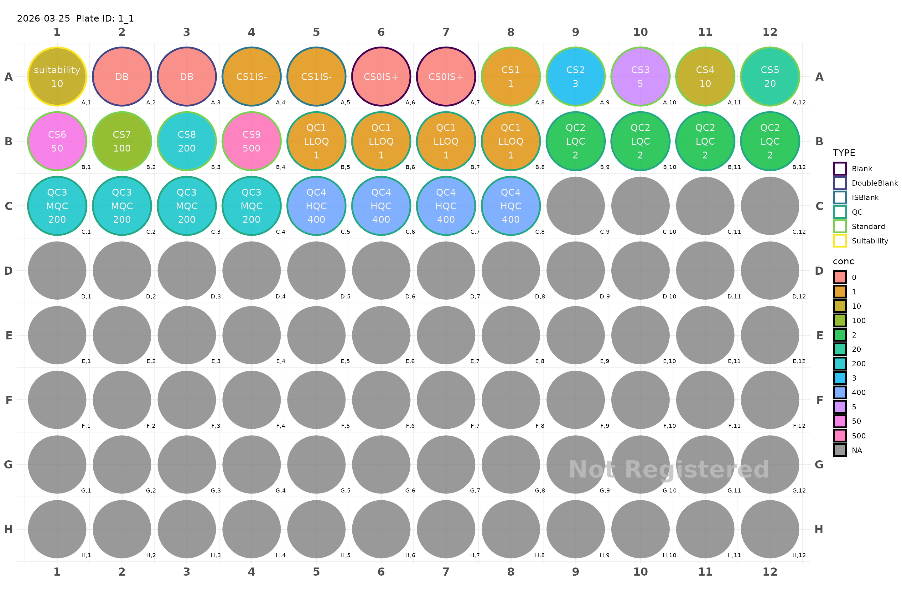
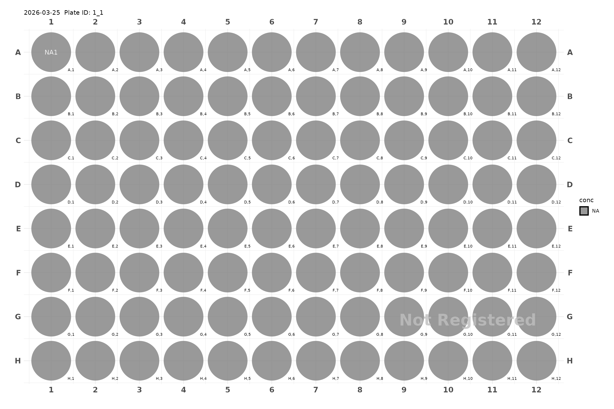
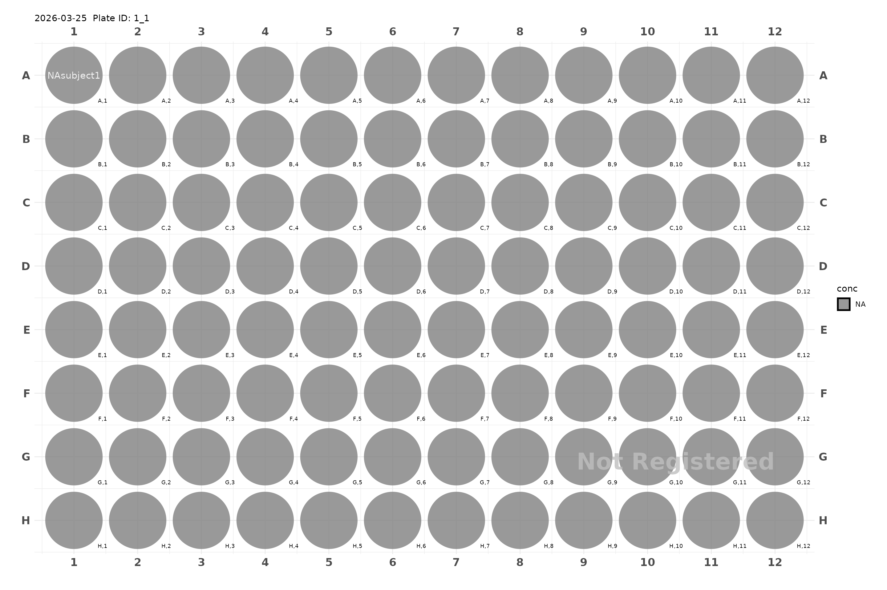
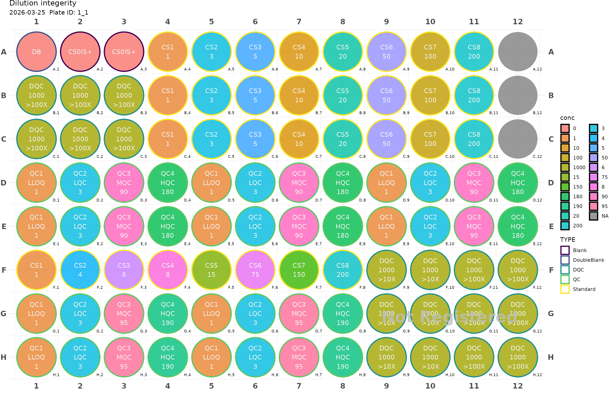

# Plate Design and Management

In our proposed workflow, we put a lot of emphasis on the plate design
and management. The plate will carry all information needed not only for
bioanalytical purposes, but also the pharmacokinetic information needed
for the study.

``` r
library(PKbioanalysis)
```

## Plate generation, reusing and managing plates

``` r
plate <- generate_96() 
plot(plate)
#> Plate not registered. To register, use register_plate()
#> Warning: Removed 96 rows containing missing values or values outside the scale range
#> (`geom_text()`).
```



PKbioanlysis has simple database management system to keep track of the
plates you have generated. After designing statistisfactory plate, you
can register it in the database. After that you can generate injection
sequences and dilution schemes.

You can always use [`print()`](https://rdrr.io/r/base/print.html) on the
created plate to see the metadata associated with it.

``` r
print(plate)
#> 96 Well Plate 
#>  
#>  Active Rows: A B C D E F G H 
#>  Last Fill: A,1 
#>  Remaining Empty Spots: 96 
#>  Description:  
#>  Last Modified: 2026-03-25 15:29:42.292634 
#>  Scheme h 
#>  Plate ID: 1_1 
#>  Registered: FALSE 
#> NULL
```

Plate name can be specified during plate generation
`generate_96(descr = "plate1")` or modified by using
`plate_metadata(plate, descr = "plate1")`.

The first part of the plate ID is unique to the plate itself, while the
second part indicated the reuse of the plate. You can reuse the plate by
calling `reuse_plate(plate_id)`. 

To find all previous plate, you can use
[`study_app()`](https://omarashkar.github.io/PKbioanalysis/reference/study_app.md)
to find it and retrieve it for reuse.

Calibration study examples

``` r
plate <- generate_96("Calibration study") |> 
    add_cs_curve(c(1, 3, 5, 10, 20, 50, 100, 200, 500)) |>
    add_DB() |> 
    add_DB() |>
    add_blank() |>   # CS0IS1
    add_suitability(conc = 20) |>
    add_QC(2, 200 ,400, qc_serial = FALSE) |> 
    add_DB() |> 
    add_blank(analyte = TRUE, IS = FALSE) |> # CS1IS0
    add_cs_curve(c(1, 3, 5, 10, 20, 50, 100, 200, 500)) |>
    add_QC(2, 180 , 400, group = "test") 

plot(plate, label_size = 1)
#> Plate not registered. To register, use register_plate()
#> Warning: Removed 48 rows containing missing values or values outside the scale range
#> (`geom_text()`).
```



``` r
plate <- register_plate(plate)
plot(plate)
```

You can use
[`make_calibration_study()`](https://omarashkar.github.io/PKbioanalysis/reference/make_calibration_study.md)
for typical calibration study instead of using
[`add_cs_curve()`](https://omarashkar.github.io/PKbioanalysis/reference/add_cs_curve.md)
and
[`add_QC()`](https://omarashkar.github.io/PKbioanalysis/reference/add_QC.md).

``` r
plate <- generate_96() |> 
    add_suitability(conc = 10) |>
    make_calibration_study(
        plate_std = c(1, 3, 5, 10, 20, 50, 100, 200, 500), 
        lqc_conc = 2, 
        mqc_conc = 200,
        hqc_conc = 400, 
        n_qc = 4, 
        qc_serial = TRUE, 
        n_CS0IS0 = 2,
        n_CS1IS0 = 2,
        n_CS0IS1 = 2)
plot(plate)
#> Plate not registered. To register, use register_plate()
#> Warning: Removed 64 rows containing missing values or values outside the scale range
#> (`geom_text()`).
```



After you are satisfied with the design, you can register the plates in
the database.

``` r
plate <- register_plate(plate)
```

Finally, you can use
[`study_app()`](https://omarashkar.github.io/PKbioanalysis/reference/study_app.md)
to further inspect the plates or to generate injection sequences and
dilution schemes.

``` r
study_app()
```

## Adding samples with pharmackinetic information

PKbioanalysis offers multiple ways to add samples to plate. We recommend
having external spreadsheet with the pharmacokinetic data in it, and
then use
[`add_samples()`](https://omarashkar.github.io/PKbioanalysis/reference/add_samples.md)
to add the samples with `vtime = TRUE` to the plate.

Current supported pharmacokinetic information are: - Sample ID - dose -
Route - CMT - Time - Factor (i.e strata)

You might also specify the dilution factor for each sample with `dil`.

``` r
plate <- generate_96() |> add_samples(1:20)
plot(plate)
#> Plate not registered. To register, use register_plate()
#> Warning: Removed 95 rows containing missing values or values outside the scale range
#> (`geom_text()`).
```



### Adding samples manually

``` r
plate <- generate_96()

plate <- plate |> 
    add_samples(samples = c("subject1", "subject2", "subject3"))

plot(plate)
#> Plate not registered. To register, use register_plate()
#> Warning: Removed 95 rows containing missing values or values outside the scale range
#> (`geom_text()`).
```



### Adding samples from external spreadsheet by pharmacokinetic data

In this example, will will pass pharmacokinetic data to
[`add_samples()`](https://omarashkar.github.io/PKbioanalysis/reference/add_samples.md).
In this case, we don’t need to repeat time for each sample, hence we set
`vtime = TRUE`.

``` r
data(Indometh)
plate <- generate_96() |> 
    add_samples(samples = Indometh$Subject, 
                time = Indometh$time, vtime = TRUE)
plot(plate, color = "time")
plot(plate, color = "samples")
```

Time propagated automatically for each subject.

``` r
plate <- generate_96() |> 
    # add_samples_c(c("subject1", "subject2"), time = c(0, 10, 30, 60, 120), factor = "Male") |>
    add_samples("subject1", time = c(0, 10, 30, 60, 120), 
                  factor = "Male") |>
    add_samples("subject2", time =   c(0, 10, 30, 120), 
                  factor = "Female") 

plot(plate, color = "time")
plot(plate, color = "samples")
plot(plate, color = "factor")
plot(plate, color = "conc")
```

#### Cross-over Food Effect Example

If you have a cross-over study, you can use `add_samples_c()` to create
the full design quickly. Here samples are not uniquely defined, but you
can use prefix to prepend the sample name.

``` r
plate <- generate_96() |> 
    add_samples_c(4, time = c(0, 10, 30, 60, 120), 
         factor = c("Fed", "Fast"), prefix = "subject") 

plot(plate, color = "time")
plot(plate, color = "samples")
plot(plate, color = "factor")
plot(plate, color = "conc")
```

## More advanced filling layouts

You might wish to position your samples in specific location on the
plate, also you might want to fill either horizontally or vertically.

``` r
plate2 <- generate_96("Dilution integerity") |> 
  add_DB() |>
  add_blank() |> 
  add_blank() |> 
  fill_scheme("h", lbound = 4, rbound = 11) |>
  add_cs_curve(c(1, 3, 5, 10, 20, 50, 100, 200), rep =3) |> 
  fill_scheme("h", tbound = "D", bbound = "E", lbound = 1, rbound = 12) |>
  add_QC(3, 90, 180, reg = T, n_qc = 6, qc_serial = F) |>
  fill_scheme("h", lbound = 1, rbound = 4) |>
  add_DQC(conc = 1000, 100, rep = 6) |> 
  fill_scheme("h", lbound = 1, rbound = 8) |>
  add_cs_curve(c(1, 4, 6, 8, 15, 75, 150, 200)) |> 
  fill_scheme("h", tbound = "G", bbound = "H", lbound = 1, rbound = 8) |> 
  add_QC(3, 95, 190, reg = T, n_qc = 4, qc_serial = F, group = "test") |>
  fill_scheme("v", lbound = 9, rbound = 12, tbound = "F", bbound = "H") |>
  add_DQC(conc = 1000, 10, rep = 6) |>
  add_DQC(conc = 1000, 100, rep = 6) 
```

``` r
plot(plate2)
#> Plate not registered. To register, use register_plate()
#> Warning: Removed 3 rows containing missing values or values outside the scale range
#> (`geom_text()`).
```



## Metabolic study (Multiple plates)

``` r
plates <- make_metabolic_study(
    cmpd = c("NE", "DA", "5HT", "HVA", 
             "DOPAC", "MHPG", "5HIAA", "VMA"),
    time_points = c(0, 5, 10, 15, 30, 45, 60, 90, 120),
    n_NAD = 3, 
    n_noNAD = 2
)
#> ℹ Created study with ID: 64ef137d-a1d1-49d1-9683-a1e55d8c9857
#> ℹ Adding dosing and subjects information...
#> ✔ Dosing information added.
#> ℹ Adding subjects information...
#> ✔ Subjects information added.
#> ℹ Adding sample log information...
#> ✔ Sample log information added.
```

``` r
length(plates)
#> [1] 8
```

``` r
plot(plates[[1]], color = "samples", label_size = 1)
plot(plates[[2]], color = "samples", label_size = 1)
plot(plates[[3]], color = "samples", label_size = 1)
plot(plates[[4]], color = "samples", label_size = 1)
plot(plates[[5]], color = "samples", label_size = 1)
plot(plates[[6]], color = "samples", label_size = 1)
```

``` r
register_plate(plates)
```
