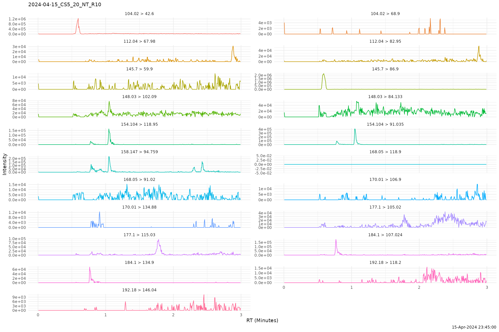

# Visualize Chromatograms

``` r
library(PKbioanalysis)
#> 
#> Attaching package: 'PKbioanalysis'
#> The following object is masked from 'package:stats':
#> 
#>     integrate
```

We will load Waters `.raw` Chromatograms using
[`read_chrom()`](https://omarashkar.github.io/PKbioanalysis/reference/read_chrom.md).
We need to have method specified in the `method` argument. This can be
done or edited using the interface in
[`study_app()`](https://omarashkar.github.io/PKbioanalysis/reference/study_app.md).

    #> [1] TRUE

``` r
chrompath <- system.file("extdata", "waters_raw_ex", package="PKbioanalysis")
chroms <- read_chrom(chrompath, method = 1)
#> 
#> ── Reading Waters Raw Files
#> Downloading uv...Done!
#> ℹ Found 7 raw files
#> → Loading
#> → loading /tmp/RtmpvdoTvD/temp_libpath1e143db6ca59/PKbioanalysis/extdata/waters…
#> → loading /tmp/RtmpvdoTvD/temp_libpath1e143db6ca59/PKbioanalysis/extdata/waters…
#> → loading /tmp/RtmpvdoTvD/temp_libpath1e143db6ca59/PKbioanalysis/extdata/waters…
#> → loading /tmp/RtmpvdoTvD/temp_libpath1e143db6ca59/PKbioanalysis/extdata/waters…
#> → loading /tmp/RtmpvdoTvD/temp_libpath1e143db6ca59/PKbioanalysis/extdata/waters…
#> → loading /tmp/RtmpvdoTvD/temp_libpath1e143db6ca59/PKbioanalysis/extdata/waters…
#> → loading /tmp/RtmpvdoTvD/temp_libpath1e143db6ca59/PKbioanalysis/extdata/waters…
#> ✔ Loaded 7 chromatograms
#> → loading /tmp/RtmpvdoTvD/temp_libpath1e143db6ca59/PKbioanalysis/extdata/waters…
```

``` r
get_sample_names(chroms)
#>                     sample sample_id
#> 1      2024-04-15_DB_NT_R1         1
#> 2  2024-04-15_CS4_10_NT_R9         2
#> 3 2024-04-15_CS5_20_NT_R10         3
#> 4 2024-04-15_CS6_50_NT_R11         4
#> 5   2024-04-15_CS3_5_NT_R8         5
#> 6   2024-04-15_CS2_2_NT_R7         6
#> 7   2024-04-15_CS1_1_NT_R6         7
```

``` r
plot_chrom(chroms, sample_id = 3, ncol  = 2)
```



More interactive features for integration and visualization are to be
added in the future.
